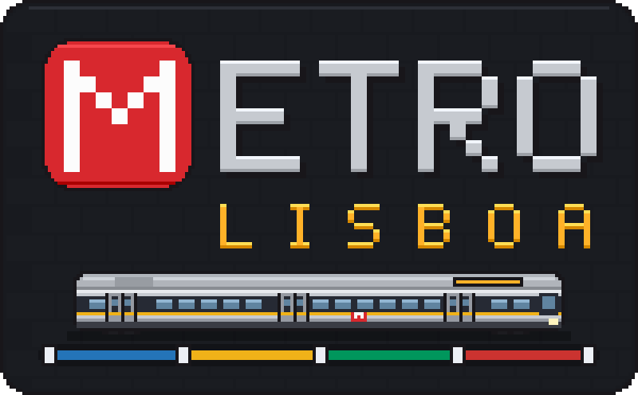
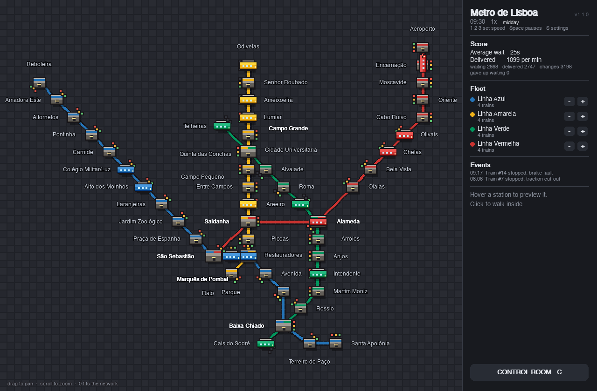
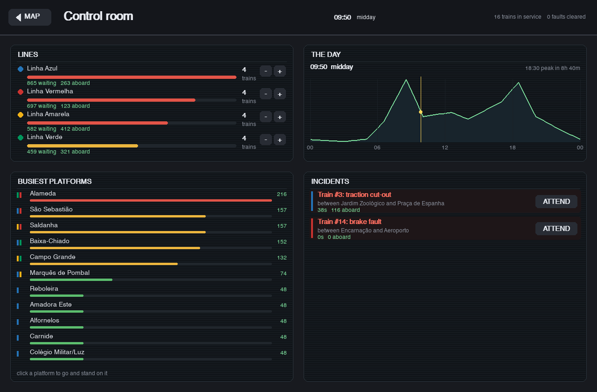
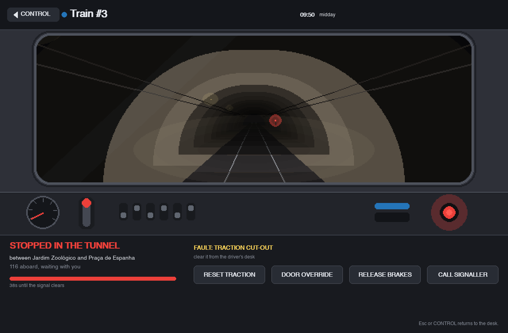
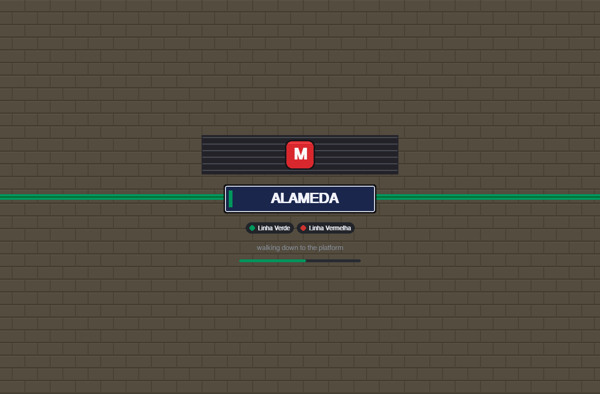
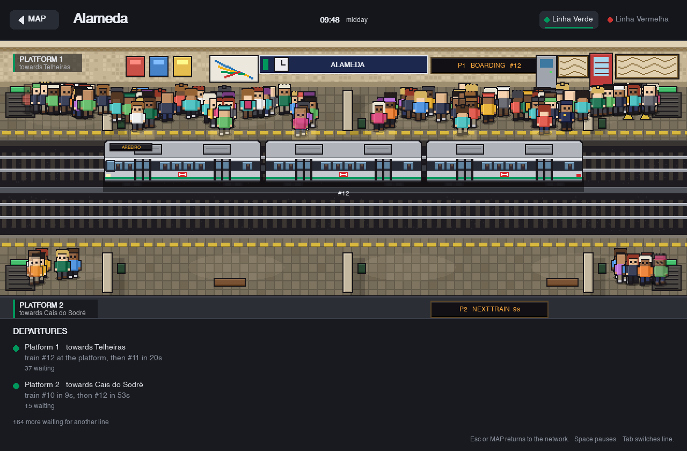
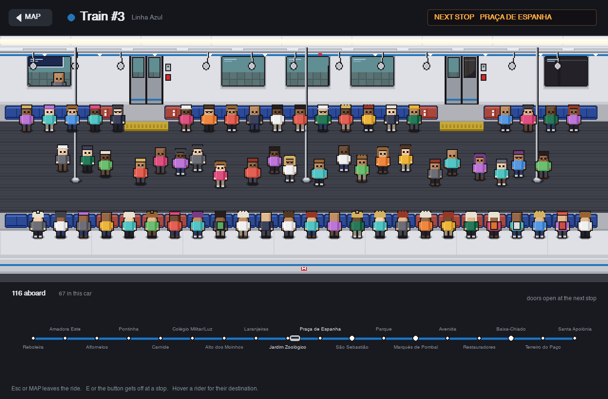
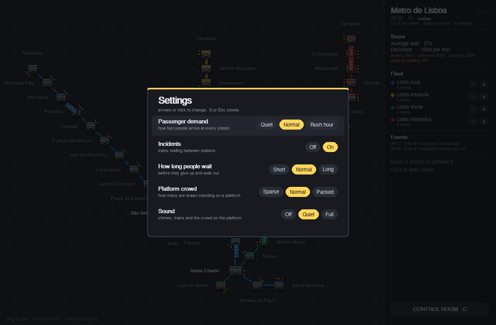

<p align="center"></p>

# Metro Lisboa

A Lisbon metro simulation you can walk around in, in pixel art. Trains run the
four real lines, passengers plan their own journeys and change at interchanges,
and you can drop from the network map into any station, then step aboard a
train and ride it to the other end of the city.



## Running it

```
python3 -m venv .venv
.venv/bin/pip install -r requirements.txt
.venv/bin/python init.py
```

Needs Python 3.12 or newer.

### Easier ways to launch it

- **Download the app** from the [Releases](../../releases) page: unzip it,
  drop it into Applications, then right-click and Open the first time, since
  it is not signed.
- **Double-click `Metro.command`** on macOS. It sets up the virtual environment
  the first time and starts the game every time after that.
- **Build an app** you can drop into Applications:

  ```
  tools/build_app.sh --install
  ```

  This builds `dist/Metro Lisboa.app` and copies it into Applications, so it
  opens from Launchpad or Spotlight like anything else. Python, the map data
  and the icon are inside it, so it runs on a Mac with nothing else installed.
  Leave off `--install` to only build. On Linux and Windows the result is a
  folder `dist/Metro Lisboa` with an executable in it. The first launch of an
  unsigned app on macOS needs a right-click, then Open.

## What you can do

**Run a day.** A second of play is a minute of the day, so a full day takes
twenty-four minutes and opens at seven, climbing into the morning peak. The
network fills and empties with the hour: the outskirts pour into the middle of
the city in the morning, the middle pours back out in the evening, and by three
in the morning the platforms are all but empty. Four trains a line does not
cover a peak, so the fleet is yours to move.

**Run the network from the map.** Drag the map to move around it and scroll to
zoom in on a corner of the city; zoomed in, a small picture of the whole network
sits in the corner with your view boxed on it, and clicking it takes you there.
Hover a station to see who is waiting, and three pips beside each one light up
as its crowd grows. The panel scores you on
average wait and deliveries per minute, gives you a `+` and `-` per line to put
a train into service or take one out, and logs stalls and fleet changes as they
happen. Run the service too thin and people give up waiting and walk out, which
the panel counts against you in red.

**Run it from the control room.** `C`, or the button on the panel, opens a
desk with the whole network on it: every line worst first with what is waiting
for it and riding on it, the busiest platforms, the shape of the day with a
marker on the hour and how long until the next peak, and whatever has broken
down. The fleet buttons are there too, so you can move trains onto a line
before the rush rather than during it, and clicking a platform takes you down
to stand on it.



**Go and fix what is broken.** A train that stops between stations now stays
stopped: it has a fault on it, and left alone it sits there for minutes with
everyone aboard. Attend to it from the control room and you get the driver's
view, looking down the tunnel at the signal holding you, with the desk in front
of you. Four controls, one of which is the right one for the fault. Get it
right and the signal goes green and the train pulls away; get it wrong and it
costs you a few seconds.



**Walk into any station.** Clicking one takes you down through a tiled entrance,
past the sign telling you which lines stop there, and out onto the platform.
Coming back up runs the same way in reverse.



**Watch a platform work.** Both directions are live: trains pull in, the doors
slide open, people get off and head for the stairs while the queue at the doors
files on, and the doors close again. New passengers come up out of the stairwell
rather than appearing out of nowhere. While they wait they check their phones,
sit on the benches, wander over to read the next-train display, and get up and
line up by the doors when a train is close. The signs count down. Interchanges
have a tab per line, and the station sign changes colour with it.

**No two stations look alike.** Every one of the fifty is clad differently, the
way the real ones are: its own colours, its own pattern on the wall, its own
tile panels and frieze, down to the floor and the pillars. A station's look
comes from its name, so it is the same every time you walk in, and the ones
with a look of their own have it set by hand — Rossio has the wave calçada,
Campo Pequeno the brick of the bullring above it, Olaias is the loudest
station on the network. The passage you walk down is tiled in the colours of
the station at the bottom of it, and the platform sliding past the windows of
a train is in that station's colours too.



**Get on and ride.** Click a train while its doors are open and you step through
them into the car. The tunnel scrolls past the windows and the next platform
slides in as you arrive. Riders take the seats and the standing room; hover one
to see where they are going. The line diagram above the board tracks the train,
and you can get off at any stop.



**Listen to it.** Trains rumble in and pull out, the doors chime open and beep
shut, and a platform murmurs in proportion to the number of people standing on
it. None of it is a recording: every sound is worked out from arithmetic when
the game starts, so there is nothing to ship alongside the code. Turn it down
or off in the settings.

**Change how it plays.** `S` opens the settings over whatever is on screen and
pauses the game while they are open.



## Controls

| Key or click | Does |
|---|---|
| `C` | Open the control room |
| Drag the map | Move around the network |
| Scroll wheel, `+` `-` | Zoom in and out where the cursor is |
| Arrow keys | Pan |
| `0` | Fit the whole network again |
| Click a station | Walk into it |
| Click a stopped train (in a station) | Board it |
| `E` or the green button (on a train) | Get off at this stop |
| `Tab` (in an interchange) | Switch line |
| `Esc` or the MAP button | Back to the network |
| `S` | Open the settings |
| `Space` | Pause |
| `1` `2` `3` | Run at 1x, 2x, 4x |
| `+` `-` (panel) | Add or remove a train on a line |

## How it is put together

- `src/network.py` loads the network from `data/lisbon.json`: 50 stations on a
  0..1000 grid, four lines as ordered station lists.
- `src/routing.py` plans a journey as legs of "ride this line, get off here",
  over a graph of (station, line) states so changing costs something.
- `src/daytime.py` is the hour of the day: how busy the network is at it and
  which way the city is travelling.
- `src/audio.py` synthesises every sound in the game at startup and keeps the
  looping backgrounds sliding to the level the scene on screen asks for.
- `src/control_room.py` is the desk, and `src/tunnel_view.py` is the view down
  the tunnel from a train that has stopped, with the controls that clear it.
- `src/sim.py` moves the trains, keeps them a safe headway apart, spawns
  passengers, and handles boarding, changes, stalls, the fleet and the score.
  It knows nothing about screens: scenes read its state and drain its events.
- `src/settings.py` holds the handful of values the settings menu changes.
- `src/route.py` draws the map, owns the main loop and its three scenes, and
  holds the transitions between them. `Camera` is what you move around the map
  with: it only zooms in whole numbers of pixels, so the art never scales
  unevenly, and station names are drawn live at screen resolution on top so
  they stay sharp at any zoom.
- `src/station_style.py` says what each station is clad in: the palettes, the
  wall patterns and the tile motifs, and which of them a name comes out at.
- `src/station_view.py`, `src/station_layout.py` and `src/station_train.py` are
  the station scene. `src/ride_view.py` is the ride. `src/sprites.py` has the
  pixel characters and the caches they need to stay cheap.

Everything in the world is drawn at half size onto a 24-bit surface and scaled
up with no smoothing, which is where the chunky pixels come from. The 24 bits
matter: a surface with an alpha channel picks up stray alpha from sprite blits
and turns into coloured blocks on a real display driver, which the dummy driver
used in tests will not show you.

`tools/make_logo.py` draws the logo and the window icon. `tools/screenshots.py`
regenerates the pictures above. `tools/build_app.sh` packages the app.

## Tests

```
.venv/bin/python -m pytest -q
```

A hundred and sixty-eight tests, running headless in a couple of seconds each. They cover the
rules that are easy to break by accident: people only board trains going their
way, everyone is through the doors before they close, countdowns that never
jump backwards, no two trains on one segment or one platform, nothing standing
in a doorway, platform queues that stay bounded over a long session, a drag of
the map that never turns into walking into a station, no two stations next to
each other clad the same, sounds that come out at the length they were drawn
at, a fault that only the right control on the driver's desk clears, and
every scene rendering without raising. GitHub Actions runs them on every push, and a
tagged release builds the macOS app.

## License

Source-available, all rights reserved. You can read the code and play the game
yourself, but you cannot redistribute it, publish something based on it, or use
it commercially without permission. See [LICENSE](LICENSE).
